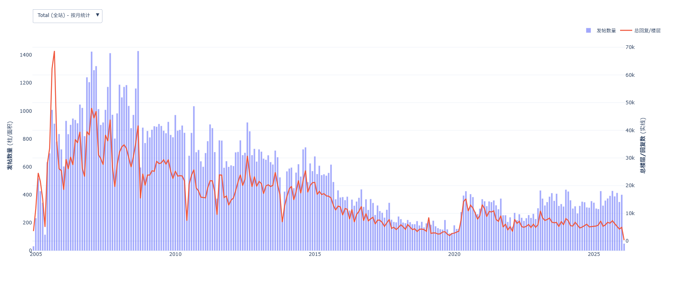
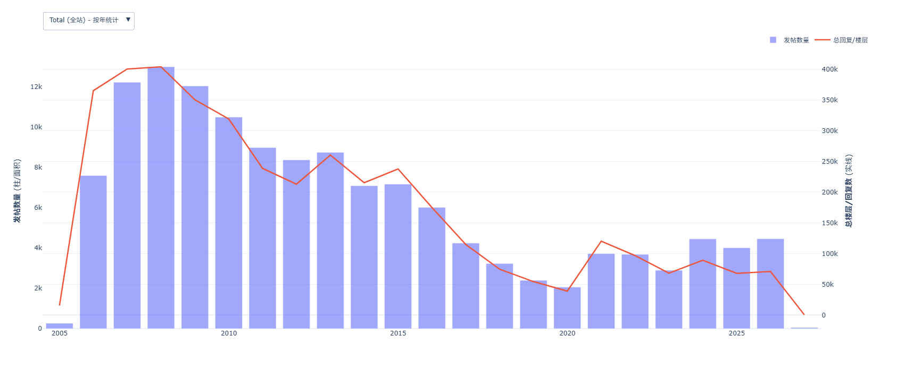
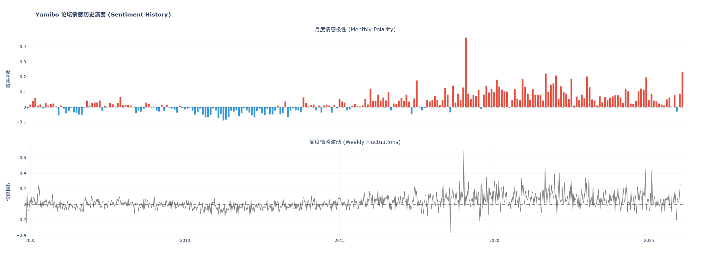
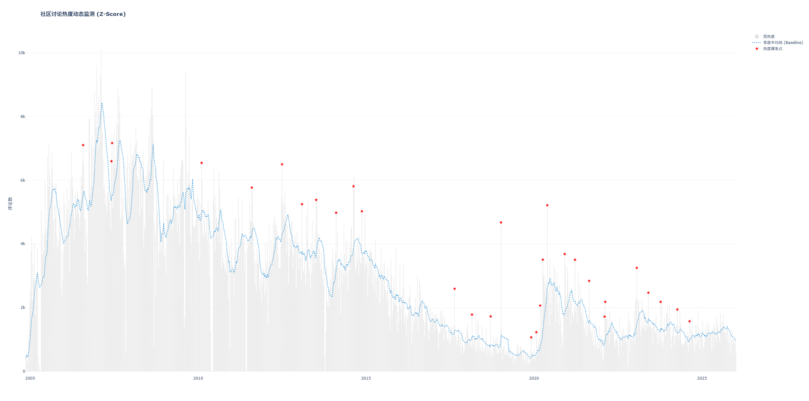
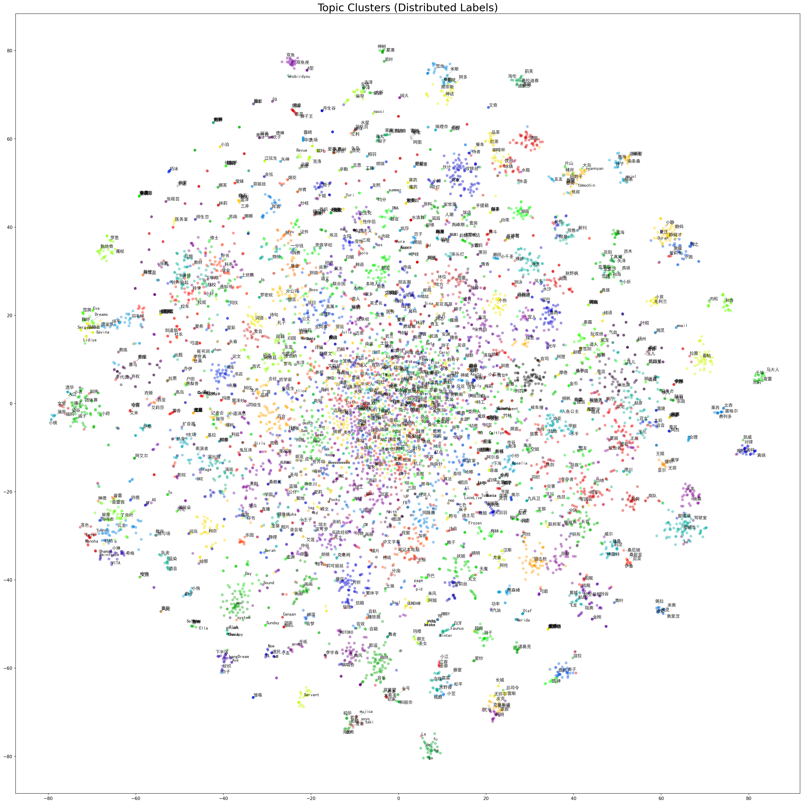
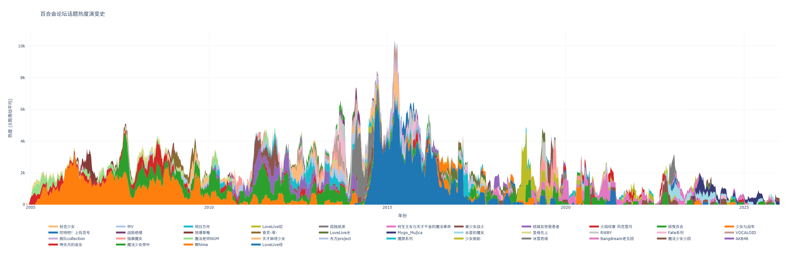

# 百合会论坛分析工具（WSL）

## 一、爬取帖子

### 核心代码

- `monitor.py`：多进程管理，控制并发爬取与代理池维护
- `main.py`：爬虫入口
- `spider.py`：爬虫功能实现
- `login_discuz.py`：登录百合会论坛
- `downloader.py`：下载附件图片和表情包（实际不好用，也没啥用，可优化掉）
- `proxy_manager.py`：维护代理池（生成 `proxies_verified.json`）
- `utils.py`：输出日志，组织爬取帖子的目录（实则问题多多，需要后续处理）
- `config.py`：维护爬取的关键参数

### 运行

```bash
pip install requests beautifulsoup4
python monitor.py
```

首先配置好 `config.py` 中的参数。注册百合会会员需要在主站（而不是论坛），还要交1块钱。

运行时，首先从论坛主页开始检测板块，再逐板块翻页获得帖子url并记录在 `data/` 目录下的 `forum_xx_threads.txt` 中，这一步骤的扫描进度保存在 `data/` 下的`forum_xx_scanpage.txt` 中。板块号与板块名的对应如下：

    '16': '管理版',
    '370': '论坛指南',
    '5': '动漫区',
    '33': '海域区',
    '13': '贴图区',
    '49': '文学区',
    '44': '游戏区',
    '379': '影视区'

随后将检测到的所有url扔进线程池，每个线程按batch抽取。 `data/` 下的 `finished_threads.txt` 存储已完成爬取的url。每个进程会从 `proxy_manager.py` 维护的 `proxies_verified.json` 中获取可用的免费代理进行爬取，主打一个堆量。如果不这么做很容易被发444，此时建议大幅缩减并行数。

预计检测到14w左右的帖子。这些帖子存储在 `data/` 下的以日期为名字的一级目录中，以帖子的标题为二级目录名，即每个二级目录表示一个帖子，其所属的一级目录对应日期为该帖子发布的日期（但对于以运行爬虫的日期为名的一级目录，会出现日期识别问题，需要后期重新归档）。

帖子内部目录结构：
```text
这里是帖子标题/
├── attachment/     # 存储附件列表，大多是图片，但基本下不全
├── images/         # 存储表情包，但页下不全
├── meta.json       # 存储帖子的网址、所属板块、标题、回复数与爬取日期
└── replies.csv     # 分楼层的帖子内容，文本很脏
```

在执行末期，多进程多线程很容易重复爬取，因此最后一部分帖子可能需要舍去（我自己舍了40个）。预计用3-4天爬完。

## 二、文本清洗与归档

### 核心代码

- `cleaner.py`：清洗重复贴、帖子名与帖子内容
- `organizer.py`：检测帖子1楼的时间，据此重新将帖子归档到对应日期文件夹

### 运行

依次执行这两个脚本，大约共需个把小时。这两个任务很吃CPU性能，我使用的是20逻辑核的i5-14600，仍然用了相当时间。

```bash
pip install pandas beautifulsoup4 opencc-python-reimplemented tqdm
# 可选安装 lxml 作为解析器，虽然代码没直接 import，但 BeautifulSoup 经常依赖它来提高速度
# opencc-python-reimplemented 如果出问题就卸掉重装成 opencc 吧
python cleaner.py
python organizer.py
python organizer.py
```

`cleaner.py` 会检测所有标题相同仅时间戳不同的帖子并删除（爬取时会在帖子标题后加时间戳），这会导致误删标题相同内容不同的帖子，但这部分帖子一般是功能性帖子，暂且不管。随后会对帖子标题和帖子内容进行清洗，如繁体转简体，删去html标签等等，但清洗仍然不够彻底。每个帖子内清洗后的内容输出在 `replies_cleaned.csv` 中。

第一次运行 `organizer.py` 时请选择功能1，在此之前请自行配置爬虫的运行日期，因为识别不出时间的帖子都会被放到爬虫运行日期的目录下。清洗出错，或者爬取的帖子没有内容，会被归档到 `data/Unknown_Date` 下。

第二次运行 `organizer.py` 时请选择功能2，对清洗出错分类到 `data/Unknown_Date` 下的帖子根据原始帖子内容 `replies.csv` 进行归档。这样 `data/Unknown_Date` 下就只有无内容只有帖子标题的帖子了。

## 三、活跃度分析

### 核心代码

- `post_number_stats.py`：按日期分板块统计帖子数与楼层数，绘图。

### 运行

```bash
pip install pandas plotly tqdm
python post_number_stats.py
```

该任务很吃内存，请注意根据你自己的内存情况对其中参数进行调整。

依据日期一级目录与每个帖子的 `meta.json` ，分板块（也有全站），分时间粒度（日、月、年）绘制活跃度统计图，输出到根目录下的 `forum_advanced_stats.html` 中，用浏览器打开即可。

红色实线为楼层数曲线，蓝色柱状图（日活统计中为线填充）为帖子数。日活曲线很丑，月活的图最为好看，按年则能很直观的看出论坛热度的变化趋势。值得一提的是明明是双纵坐标，莫名其妙的x轴居然都对不齐。

用户指南、影视区这两个板块基本没啥参考价值，忽略即可。值得一提的是，我不小心把2026年1月的数据也参与统计了，这显然是有问题的。另一个问题是，我在统计热度时，最小单位为帖子，也就是说后于帖子回复的楼层也会被算到帖子发表当日的热度中。我觉得这也有一定合理性，优化了可能更好，但是我懒得改了。

要保存曲线为图片的话，点击右上角的最左边按钮即可通过浏览器下载为png格式。其他的工具有点鸡肋，用的很少。如果用的时候搞得图乱七八糟，用 `Autoscale` 按钮即可恢复。

以下为全站的月度与年度热度曲线：




## 四、情感分析

### 核心代码

- `sentiment_analyse.py`：遍历 `data/` 下的所有帖子进行情感分析，并按日期叠算
- `sentiment_stats.py`：按周、按月加权汇总情感并绘图
- `peak_stats.py`：分析热度尖峰（反常值），绘图并输出为csv

### 运行

`sentiment_analyse.py` 的运行需要情感分析模型，此处采用 `distilbert-base-multilingual-cased-sentiments-student`。不知道为什么我这里如果使用远程接口会有问题，所以部署到本地了。如果可行，可以将 `sentiment_analyse.py` 中的模型路径目录替换为远程接口。

```bash
# 下载模型
git clone https://hf-mirror.com/lxyuan/distilbert-base-multilingual-cased-sentiments-student
```
下载后，需要去该网址（不能挂梯子），找到 `Files and versions` 下面下载 `pytorch_model.bin` 与 `model.safetensors`，替换你克隆到根目录的模型目录中的对应文件（因为git clone不了这么大的文件）。

```bash
pip install pandas plotly torch numpy transformers tqdm
python sentiment_analyse.py
python sentiment_stats.py
python peak_stats.py
```

运行完成后的结果目录结构如下：
```text
result/sentiment/
├── sentiment_daily_global.csv     # sentiment_analyse.py 生成的按日计算的全站帖子情感指数，是后续两个脚本的源文件
├── sentiment_weekly.csv           # sentiment_stats.py 生成的按周计算的全站帖子情感指数
├── sentiment_monthly.csv          # sentiment_stats.py 生成的按月计算的全站帖子情感指数
├── sentiment_peaks_list.csv       # sentiment_stats.py 生成的情感尖峰列表，其中周次用起始日期~结束日期表示
├── sentiment_history_chart.html   # sentiment_stats.py 生成的月度情感指数柱状图（采用颜色区分，较为鲜明）和周度情感波动曲线
├── weekly_activity_peaks.csv      # peak_stats.py 生成的热度尖峰列表，因为论坛本身热度有差异，所以计算热度采用相对差值方式计算
└── activity_dynamic_peaks.html    # peak_stats.py 生成的带有热度尖峰标注的周热度柱状图与动态区间平均热度曲线
```

`sentiment_analyse.py` 由于使用深度学习模型，这个步骤很吃GPU，而且任务规模很大，我使用的台式机显卡为16G 5060Ti，约3小时左右完成。后续两个步骤是简单的小规模数据处理，很快就能完成。

以下为情感波动与热度尖峰结果图：




## 五、词频分析

### 核心代码

- `merge_stopwords.py`：维护根目录中的停用词表 `stopwords.txt`, 实现去重和排序
- `nlp_analyse.py`：提取帖子标题文本和内容文本，从标题和整体（标题+正文）两个维度做统计词频
- `merge_keywords.py`：向情感分析阶段得到的情感尖峰与热度尖峰列表后面加入当周的top20热词
- `generate_video.py`：通过生成的词频逐日增量表生成可视化的柱状图竞赛视频

### 运行

由于停用词表的严格程度极大程度上影响可视化动态柱状图竞赛视频的效果，因此我们需要对停用词表做多次迭代。先保证现成的 `stopwords.txt` 到根目录，随后执行 `nlp_analyse.py`：

```bash
# 预先装好本步骤所需的所有依赖
pip install pandas jieba tqdm gensim

python nlp_analyse.py
```

在 `result/` 目录下的 `nlp/` , `viz/` 两个文件夹中会生成 `cumulative_xxx.csv` 这类供生成可视化视频的宽表， `top500_xxx.csv` 这类统计论坛中总词频的表，以及 `xxx_top20_xxx.csv` 这类按一定时间粒度排布的热词榜单。将 `top500_xxx.csv` 这类表移到根目录，重命名为 `stopwords.csv` , 删除其中“有意义词语”的行，保留“如果在可视化柱形图竞赛中看到会有点莫名其妙不明所以”的词。随后将其与原有的停用词表 `stopwords.txt` 合并（已去重和排序）：

```bash
python merge_stopwords.py
```

如果在生成的其他类型csv中有想要筛除的词，直接加入到 `stopwords.txt` 的底部，运行上述程序时也会自动帮你去重和排序。随后重复以上步骤，直到生成csv中的的结果让你满意为止。

随后执行：

```bash
python merge_keywords.py
```

在 `result/merged_analysis` 目录下会输出加入了当周top20热词的情感尖峰与热度尖峰csv文件 `sentiment_peaks_with_keywords.csv` 与 `activity_peaks_with_keywords.csv` ，于是可以更容易地分辨出情感尖峰与热度尖峰的形成原因。

在生成视频之前，首先做数据源的样本文件（例如： `cumulative_general_all.csv` ）找到第一行第一格，填入“date”。再从 `C:\Windows\Font` 目录下挑选一种你喜欢的简体字体，复制到工作根目录下（例如我复制 `simhei.ttf` ）。随后修改 `generate_video.py` 中的 `font_path` 参数为对应字体。

在运行之前，要为 `bar_chart_race` 包下载 `ffmpeg` 依赖，再运行：

```bash
pip install matplotlib bar_chart_race
sudo apt-get install ffmpeg
python generate_video.py
```

随后控制台假死，等待几分钟后视频导出完成。导出视频的一些关键参数可以根据需求改动，参数的具体说明已写在代码注释中。

## 六、词语聚类与IP热度分析

### 核心代码

- `cluster_topics.py`：根据词向量模型实现词语筛选与聚类，并画聚类图
- `streamgraph.py`：依据实现的分类结果统计类内总词频的时间变化

### 运行

```bash
pip install adjustText numpy pandas gensim scikit-learn matplotlib
python cluster_topics.py
python streamgraph.py
```

`cluster_topics.py` 会加载词频分析步骤中 `nlp_analyse.py` 生成的词向量模型 `yamibo_word2vec.model` （位于 `result/nlp` 目录下，与 `yamibo_word2vec.model.syn1neg.npy` 和 `yamibo_word2vec.model.wv.vectors.npy` 才构成完整的模型文件），进行聚类与迭代。

每次迭代，会删去过于庞大的类或者当前规模最大的类（我们认为其为无意义词语的集合），迭代给定次数后在 `result/nlp/clusters` 下得到更新后的最终结果 `topic_clusters_readable.txt`，同时每迭代给定次数会绘制一幅当前的聚类图 `viz_iter_xx.png` 。在 `cluster_topics.py` 头部有若干可调整参数，会极大地影响迭代聚类的结果，请视情况自行调整。代码中给出的是能得到我比较满意的结果的参数。

值得一提的是，在这种规则下，诸如《终将成为你》、《安达与岛村》、《我买下了与同班同学的每周密会》等佳作会因为题材相似、IP规模小而被分到同一大类，然后被迭代掉，一些题材相似的玛丽苏文也会出现类似情况。因此，这里统计的”类“所指的基本只能代表某一IP的规模，比如如果迭代次数过多一定会首先优化掉的《魔法少女奈叶》所代表的类。此外，无效类始终是存在的，需要用自己的眼睛忽视。

随后请根据 `topic_clusters_readable.txt` 中的结果，自行在 `streamgraph.py` 中的头部编辑每个类对应的IP名称与类序号，此过程需要相当的知识量积累，以及手和眼睛。在此之后可以直接运行 `cluster_topics.py`，会在 `result/viz` 目录下获得交互式可视化IP热度流水图 `topic_evolution_streamgraph.html`。如果对出来的流水图的小峰不满意，可以适当调节 `PLOT_THRESHOLD` 参数控制阈值。

以下为聚类结果图与热度流水总图。聚类结果图比较臃肿，但信息量相当大，放大来看可以很明显的看出各大IP的分布。我已经采用了一些方法尽可能地避免Tag重叠，但不可避免。热度流水图在HTML中交互查看，单击下方的某tag可以切换其显示/不显示，双击可以不显示其他所有、只显示该tag的流水曲线。


